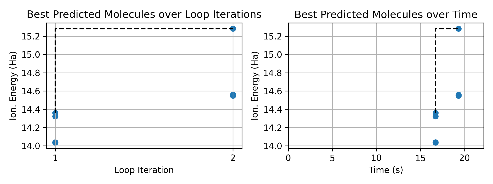

## Homework 1: ml-in-the-loop
```
initial_training_count = 10 
max_training_count = 25  
batch_size = 5 
```
Iteration 1:
	Training on 10/130258 random molecules
	Best predicted molecule: O=C1CC(=O)N2CC12 with ionization energy 14.36 Ha
	Performed 5 new simulations
	Estimate of KNN Model Mean Relative Error (MRE): 0.03 %
	Finished loop iteration in 7.24s

Iteration 2:
	Training on 15/130258 random molecules
	Best predicted molecule: O=CC(=O)N1N=NN=N1 with ionization energy 15.28 Ha
	Performed 5 new simulations
	Estimate of KNN Model Mean Relative Error (MRE): 0.10 %
	Finished loop iteration in 3.45s

Iteration 3:
	Training on 20/130258 random molecules
	Best predicted molecule: O=CC(=O)N1N=NN=N1 with ionization energy 15.28 Ha
	Performed 5 new simulations
	Estimate of KNN Model Mean Relative Error (MRE): 0.06 %
	Finished loop iteration in 2.66s

Training completed in 22.66 seconds




## Homework 2: Data Transfer Performance

| Implementation   | Number of Nodes | Training Data Size (GB) | Simulation Run / IO Time (sec) | Training Run / IO Time (sec) |
|------------------|-----------------|--------------------|-----------------|---------------|
| Parsl + futures | 1   | 0.62   | 14.09 / NA   | 77.74 / NA   |
| Parsl + file system | 1   | 0.62   | 11.33 / 0.103   | 24.21 / 0.650   |
| DragonHPC + DDict | 1   | 0.62   | 6.77 / 0.086   | 19.64 / 1.079   |
| Parsl + futures | 1   | 1.25   | 19.78 / NA   | 97.35 / NA   |
| Parsl + file system | 1   | 1.25   | 16.46 / 0.103   | 26.46 / 0.710   |
| DragonHPC + DDict | 1   | 1.25   | 11.95 / 0.072   | 21.81 / 1.294   |
| Parsl + futures | 1   | 2.50   | 30.29 / NA   | 131.15 / NA   |
| Parsl + file system | 1   | 2.50   | 26.98 / 0.099   | 26.39 / 0.735   |
| DragonHPC + DDict | 1   | 2.50   | 22.10 / 0.047   | 23.38 / 1.398   |
| ...   | ...   | ...   | ... / ...  | ... / ...  |


**Observations**
Parsl + futures is the slowest when data gets large, because sending big NumPy arrays through Python serialization becomes a bottleneck. Parsl + file system is faster for both simulation and training because data is written once to the parallel file system and reused, but reading many files can still slow things down. DragonHPC + DDict has the fastest I/O times because it keeps data in memory and uses fast RDMA communication between nodes. Overall, for small data sizes any method works, but for larger datasets the file system and DDict are much better, and DDict is the best choice for large-scale, high-speed data transfer.
